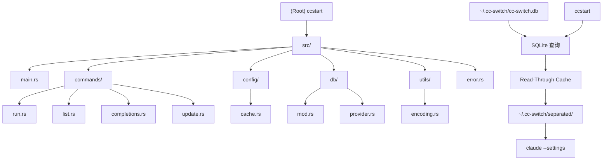

# ccstart 项目 AI 上下文文档

> ccstart - Claude Code 快速启动工具，用于管理不同项目的 Claude 配置
> 更新时间：2025-12-03

## 项目愿景

ccstart 是一个用 Rust 编写的命令行工具，旨在简化 Claude CLI 的配置管理。它从 cc-switch 的 SQLite 数据库中读取配置，采用 Read-Through Cache 模式按需生成缓存文件，并提供便捷的命令行接口来快速切换不同的 Claude 配置。

## 架构概览



### 技术栈
- **语言**: Rust 2024 Edition
- **CLI 框架**: clap 4.x (支持子命令、动态补全)
- **数据库**: rusqlite 0.31 (只读访问)
- **JSON 处理**: serde + serde_json
- **哈希**: sha2 (内容哈希比较)
- **文件系统**: dirs (用户目录处理)
- **URL 编码**: percent-encoding (配置名称安全编码)

### 核心架构
1. **数据库层 (db/)**: 只读访问 cc-switch SQLite 数据库
2. **命令层 (commands/)**: 实现所有 CLI 子命令，处理用户交互
3. **配置层 (config/)**: 缓存管理，Read-Through Cache 实现
4. **工具层 (utils/)**: 字符串编码功能
5. **错误处理 (error.rs)**: 统一的错误类型和处理

## 模块索引

| 模块 | 路径 | 职责 | 关键文件 |
|------|------|------|----------|
| **主入口** | `src/main.rs` | CLI 程序入口、参数解析、命令分发 | `main.rs` |
| **数据库** | `src/db/` | SQLite 只读访问，Provider DAO | `mod.rs`, `provider.rs` |
| **命令处理** | `src/commands/` | 实现所有子命令功能 | `run.rs`, `list.rs`, `completions.rs`, `update.rs` |
| **缓存管理** | `src/config/` | Read-Through Cache，哈希比较 | `cache.rs` |
| **工具模块** | `src/utils/` | 配置名称编码工具 | `encoding.rs` |
| **错误处理** | `src/error.rs` | 统一错误类型定义 | `error.rs` |

## 数据流

```
ccstart <name>
    │
    ▼
┌─────────────────────────────────────┐
│ 1. 打开数据库 (只读)                 │
│    ~/.cc-switch/cc-switch.db        │
└─────────────────────────────────────┘
    │
    ▼
┌─────────────────────────────────────┐
│ 2. 查询 provider                    │
│    SELECT ... FROM providers        │
│    WHERE app_type='claude'          │
│    AND name = ?                     │
└─────────────────────────────────────┘
    │
    ▼
┌─────────────────────────────────────┐
│ 3. 内容哈希比较                      │
│    SHA256(新内容) vs SHA256(缓存)    │
└─────────────────────────────────────┘
    │
    ├── 相同 ──► 使用现有缓存
    │
    └── 不同 ──► 原子写入新缓存
    │
    ▼
┌─────────────────────────────────────┐
│ 4. 执行 claude                      │
│    claude --settings <cache_path>   │
└─────────────────────────────────────┘
```

## 运行和开发

### 构建和运行
```bash
# 开发构建
cargo build

# 发布构建
cargo build --release

# 运行
cargo run -- <args>
```

### 代码质量
```bash
# 代码检查
cargo clippy --all-targets --all-features -- -D warnings

# 格式化
cargo fmt --all
```

### 测试
```bash
# 运行测试
cargo test

# 运行特定测试
cargo test <test_name>
```

## 命令接口

### 主要命令
- `ccstart list` - 列出所有可用配置（从 SQLite 查询）
- `ccstart <name> [args...]` - 使用指定配置启动 Claude
- `ccstart update` - 强制刷新所有缓存文件
- `ccstart completions <shell>` - 生成补全脚本

### 配置管理流程
1. 从 `~/.cc-switch/cc-switch.db` 只读查询 provider
2. 使用 SHA256 哈希比较决定是否更新缓存
3. 按需生成 `~/.cc-switch/separated/config-<encoded>.json`
4. 传递缓存文件路径给 `claude --settings`

## 编码标准

### Rust 代码规范
- 遵循 Rust 2024 Edition 规范
- 使用 `cargo fmt` 统一代码格式
- 使用 `cargo clippy` 进行代码检查
- 所有公共 API 需要文档注释
- 错误处理使用 `anyhow::Result<T>`

### 命名约定
- 模块名: snake_case
- 类型名: PascalCase
- 函数名: snake_case
- 常量: SCREAMING_SNAKE_CASE

## AI 使用指南

### 开发指导原则
1. **只读访问**: 不修改上游 cc-switch 数据库
2. **错误友好**: 提供清晰的错误信息和建议
3. **性能优先**: 使用哈希比较最小化 I/O
4. **跨平台兼容**: 支持 Linux/macOS/Windows

### 常见任务
- 添加新命令: 在 `src/commands/` 下创建新模块
- 扩展数据库查询: 更新 `src/db/provider.rs`
- 修改缓存策略: 更新 `src/config/cache.rs`
- 错误处理: 扩展 `src/error.rs`

### 调试指南
- 数据库位置: `~/.cc-switch/cc-switch.db`
- 缓存文件位置: `~/.cc-switch/separated/`
- 强制刷新缓存: `ccstart update`

## 发布流程

### 发布到 GitHub Release
- 创建版本标签并推送，例如：
  - `git tag v0.2.0 && git push origin v0.2.0`
- GitHub Actions 工作流 `.github/workflows/release.yml` 将为以下平台构建发布产物：
  - Linux x86_64 (`ccstart-linux-x64`)
  - Windows x86_64 (`ccstart-windows-x64.exe`)
- 工作流会上传构建产物与对应的 `SHA256` 校验文件，并自动创建 Release。

## 更新日志

### 2025-12-03 - SQLite 迁移
- 从 JSON 配置迁移到 SQLite 数据库
- 实现 Read-Through Cache 架构
- 使用 SHA256 哈希比较优化缓存更新
- 移除 `init` 命令（不再需要）
- `update` 命令改为强制刷新缓存

### 2025-10-15 - AI 上下文初始化
- 生成完整的项目架构文档
- 创建模块级文档结构
- 建立 Mermaid 架构图
- 定义开发规范和测试策略

### 2025-10-14 - 之前版本
- 002-ccswitch-rust-claude: Added Rust 2024 edition
