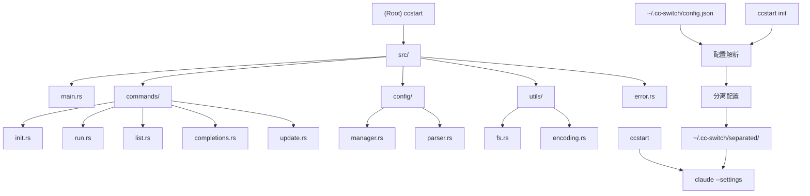

# ccstart 项目 AI 上下文文档

> ccstart - Claude Code 快速启动工具，用于管理不同项目的 Claude 配置
> 生成时间：2025-10-15 11:22:48

## 项目愿景

ccstart 是一个用 Rust 编写的命令行工具，旨在简化 Claude CLI 的配置管理。它从 cc-switch 的混合配置文件中提取独立配置，为每个配置创建独立的设置文件，并提供便捷的命令行接口来快速切换不同的 Claude 配置。

## 架构概览



### 技术栈
- **语言**: Rust 2024 Edition
- **CLI 框架**: clap 4.x (支持子命令、动态补全)
- **JSON 处理**: serde + serde_json
- **文件系统**: dirs (用户目录处理)
- **URL 编码**: percent-encoding (配置名称安全编码)

### 核心架构
1. **命令层 (commands/)**: 实现所有 CLI 子命令，处理用户交互
2. **配置层 (config/)**: 管理配置文件的解析、分离和存储
3. **工具层 (utils/)**: 提供文件系统操作和字符串编码功能
4. **错误处理 (error.rs)**: 统一的错误类型和处理

## 模块索引

| 模块 | 路径 | 职责 | 关键文件 |
|------|------|------|----------|
| **主入口** | `src/main.rs` | CLI 程序入口、参数解析、命令分发 | `main.rs` |
| **命令处理** | `src/commands/` | 实现所有子命令功能 | `init.rs`, `run.rs`, `list.rs`, `completions.rs`, `update.rs` |
| **配置管理** | `src/config/` | 配置解析、分离和管理 | `manager.rs`, `parser.rs` |
| **工具模块** | `src/utils/` | 文件系统和编码工具 | `fs.rs`, `encoding.rs` |
| **错误处理** | `src/error.rs` | 统一错误类型定义 | `error.rs` |

## 运行和开发

### 构建和运行
```bash
# 开发构建
cargo build

# 发布构建
cargo build --release

# 运行
cargo run -- <args>
```

### 代码质量
```bash
# 代码检查
cargo clippy --all-targets --all-features -- -D warnings

# 格式化
cargo fmt --all
```

### 测试
```bash
# 运行测试
cargo test

# 运行特定测试
cargo test <test_name>
```

## 命令接口

### 主要命令
- `ccstart init [--force]` - 初始化配置分离
- `ccstart list` - 列出所有可用配置
- `ccstart <name> [args...]` - 使用指定配置启动 Claude
- `ccstart update` - 同步配置变更
- `ccstart completions <shell>` - 生成补全脚本

### 配置管理流程
1. 读取 `~/.cc-switch/config.json`
2. 解析 provider 配置
3. 生成独立的 `config-<encoded>.json` 文件
4. 提供命令行接口快速切换配置

## 测试策略

### 测试覆盖
- **单元测试**: 各模块的核心函数
- **集成测试**: 命令行接口的端到端测试
- **错误处理测试**: 各种异常情况的处理

### 测试文件组织
```
tests/
├── integration/
│   ├── init_tests.rs
│   ├── run_tests.rs
│   └── list_tests.rs
├── unit/
│   ├── config_tests.rs
│   ├── utils_tests.rs
│   └── commands_tests.rs
```

## 编码标准

### Rust 代码规范
- 遵循 Rust 2024 Edition 规范
- 使用 `cargo fmt` 统一代码格式
- 使用 `cargo clippy` 进行代码检查
- 所有公共 API 需要文档注释
- 错误处理使用 `anyhow::Result<T>`

### 命名约定
- 模块名: snake_case
- 类型名: PascalCase
- 函数名: snake_case
- 常量: SCREAMING_SNAKE_CASE

### 文档要求
- 所有公共函数需要 `///` 文档注释
- 复杂算法需要内联注释
- 模块级别需要概览说明

## AI 使用指南

### 开发指导原则
1. **保持向后兼容**: 修改配置格式时确保兼容性
2. **错误友好**: 提供清晰的错误信息和建议
3. **性能优先**: 配置文件操作要高效
4. **跨平台兼容**: 支持 Linux/macOS/Windows

### 常见任务
- 添加新命令: 在 `src/commands/` 下创建新模块
- 修改配置格式: 更新 `src/config/parser.rs`
- 添加工具函数: 在 `src/utils/` 下扩展
- 错误处理: 扩展 `src/error.rs`

### 调试指南
- 使用 `RUST_LOG=debug` 环境变量启用调试日志
- 配置文件位置: `~/.cc-switch/config.json`
- 分离配置位置: `~/.cc-switch/separated/`

## 发布流程

### 发布到 GitHub Release
- 创建版本标签并推送，例如：
  - `git tag v0.1.0 && git push origin v0.1.0`
- GitHub Actions 工作流 `.github/workflows/release.yml` 将为以下平台构建发布产物：
  - Linux x86_64 (`ccstart-linux-x64`)
  - Windows x86_64 (`ccstart-windows-x64.exe`)
- 工作流会上传构建产物与对应的 `SHA256` 校验文件，并自动创建 Release（推送标签时触发）。
- 也可通过 `Actions -> Release -> Run workflow` 手动触发（`workflow_dispatch`）。

## 更新日志

### 2025-10-15 - AI 上下文初始化
- 生成完整的项目架构文档
- 创建模块级文档结构
- 建立 Mermaid 架构图
- 定义开发规范和测试策略

### 2025-10-14 - 之前版本
- 002-ccswitch-rust-claude: Added Rust 2024 edition

<!-- 手动添加内容开始 -->
<!-- 手动添加内容结束 -->